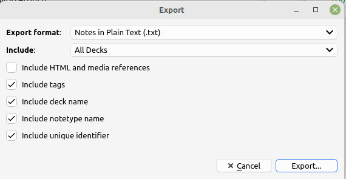

# How to export Anki Collection

Following steps were tried on Linux using Anki in version 2.1.65. 
The steps should be similar on other platforms.

1. Open Anki
2. Click on `File` -> `Export` or press `Ctrl + E`
3. As export format choose `Notes in Plain Text (*.txt)`
4. Include all decks or those decks that you want to export
5. From the list of options deselect `Include HTML and media references`.  
   Select  
   * `Include tags`,
   * `Include deck name`,
   * `Include notetype name`
   * `Include unique identifier`
    
  See the screenshot below for reference. 
  
6. Click on `Export` button and save to location from which it can be accessed by the app